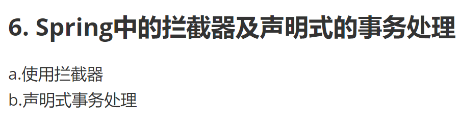
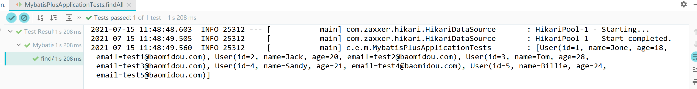

# Java 开发实习 学习记录

# [1个月学习计划](https://github.com/Kukukukiki192/ZJUT/blob/master/实习就业/实习记录/1个月学习计划.md)

学习答疑
> Q

现在学到Mybatis动态SQL那里，只看一遍视频跟着敲一遍代码我记不住。。我得多看几遍
因为你让我做的那个例子很多都要用springmvc嘛还没做，我尽快把前面结个尾下周边学springMVC边做做看
然后各个部分有些问题在下面问

**这2个我书上目录没找到对应的名词：**

SpringMVC传值就是请求参数绑定吗

rest风格我只看到这个教程有


**Spring**



这里说要学声明式的，书上还有个编程式要会吗


这部分不熟

**log4j**

找了些文字教程看有点懵感觉入门还是先看看视频比较上手

[视频教程B站](https://www.bilibili.com/video/BV1iJ411H74S?from=search&seid=5710297530909424450)

课程视频挺多的，但似乎原理啥的等以后熟了再回来看容易懂

它视频右边有课程列表是这样的 我是学完springmvc再看这个还是先看着


这里说的插件就是mybatis-plus吗


**Junit** 刚好学校课程有讲，学了些简单的操作

**设计模式** 看了两三个，打算先把你发的常见9种学了再看其他的

> A

1. rest和restful 你基本可以理解成一个东西, rest其实是一种理念，restful就是实现rest理念的一种风格
2. 传值和请求参数绑定也是一个东西，传值说的通俗一点
3. 编程式有空了解，实际开发大家声明式用的多，编程式基本很少写
4. log4j你放到最后看也可以
5. mybatis-plus是有人对mybatis进行了二次封装，提供了一些进阶功能，你要看的其实是基础的CURD，两者其实没多大差别

# 配置文件

[SpringBoot-Learning 2.x 配置文件详解](https://blog.didispace.com/spring-boot-learning-21-1-3)

**多环境配置**

我们在开发任何应用的时候，通常同一套程序会被应用和安装到几个不同的环境，比如：开发、测试、生产等。其中每个环境的数据库地址、服务器端口等等配置都会不同，如果在为不同环境打包时都要频繁修改配置文件的话，那必将是个非常繁琐且容易发生错误的事。

对于多环境的配置，各种项目构建工具或是框架的基本思路是一致的，通过配置多份不同环境的配置文件，再通过打包命令指定需要打包的内容之后进行区分打包，Spring Boot也不例外，或者说更加简单。

在Spring Boot中多环境配置文件名需要满足`application-{profile}.properties`的格式，其中`{profile}`对应你的环境标识，比如：

- `application-dev.properties`：开发环境
- `application-test.properties`：测试环境
- `application-prod.properties`：生产环境
  

至于哪个具体的配置文件会被加载，需要在`application.properties`文件中通过`spring.profiles.active`属性来设置，其值对应配置文件中的`{profile}`值。如：`spring.profiles.active=test`就会加载`application-test.properties`配置文件内容。
下面，以不同环境配置不同的服务端口为例，进行样例实验。

- 针对各环境新建不同的配置文件`application-dev.properties`、`application-test.properties`、`application-prod.properties`
- 在这三个文件均都设置不同的server.port属性，如：dev环境设置为1111，test环境设置为2222，prod环境设置为3333
- `application.properties`中设置`spring.profiles.active=dev`，就是说默认以dev环境设置
- 测试不同配置的加载
- 执行`java -jar xxx.jar`，可以观察到服务端口被设置为1111，也就是默认的开发环境（dev）
- 执行`java -jar xxx.jar --spring.profiles.active=test`，可以观察到服务端口被设置为2222，也就是测试环境的配置（test）
- 执行`java -jar xxx.jar --spring.profiles.active=prod`，可以观察到服务端口被设置为3333，也就是生产环境的配置（prod）

按照上面的实验，可以如下总结多环境的配置思路：

- `application.properties`中配置通用内容，并设置`spring.profiles.active=dev`，以开发环境为默认配置
- `application-{profile}.properties`中配置各个环境不同的内容
- 通过命令行方式去激活不同环境的配置

# Mybatis-plus

## CodeGenerator

```java
import com.baomidou.mybatisplus.core.exceptions.MybatisPlusException;
import com.baomidou.mybatisplus.core.toolkit.StringPool;
import com.baomidou.mybatisplus.core.toolkit.StringUtils;
import com.baomidou.mybatisplus.generator.AutoGenerator;
import com.baomidou.mybatisplus.generator.InjectionConfig;
import com.baomidou.mybatisplus.generator.config.*;
import com.baomidou.mybatisplus.generator.config.po.TableInfo;
import com.baomidou.mybatisplus.generator.config.rules.NamingStrategy;
import com.baomidou.mybatisplus.generator.engine.FreemarkerTemplateEngine;

import java.util.ArrayList;
import java.util.List;
import java.util.Scanner;

// 演示例子，执行 main 方法控制台输入模块表名回车自动生成对应项目目录中
public class CodeGenerator {

    //读取控制台内容
    public static String scanner(String tip) {
        Scanner scanner = new Scanner(System.in);
        StringBuilder help = new StringBuilder();
        help.append("请输入" + tip + "：");
        System.out.println(help.toString());
        if (scanner.hasNext()) {
            String ipt = scanner.next();
            if (StringUtils.isNotEmpty(ipt)) {
                return ipt;
            }
        }
        throw new MybatisPlusException("请输入正确的" + tip + "！");
    }

    public static void main(String[] args) {
        // 代码生成器
        AutoGenerator mpg = new AutoGenerator();

        // 全局配置
        GlobalConfig gc = new GlobalConfig();
        String projectPath = System.getProperty("user.dir");
        gc.setOutputDir(projectPath + "/src/main/java");
        gc.setAuthor("K");
        gc.setOpen(false);
        // gc.setSwagger2(true); 实体属性 Swagger2 注解
        gc.setServiceName("%sService");
        mpg.setGlobalConfig(gc);
        // 自定义文件命名, %s 会自动填充表实体属性
        // gc.setMapperName("%sDao");
        // gc.setXmlName("%sMapper");
        // gc.setServiceName("MP%sService");
        // gc.setServiceImplName("%sServiceDiy");

        // 数据源配置
        DataSourceConfig dsc = new DataSourceConfig();
        dsc.setUrl("jdbc:mysql://localhost:3306/mp?useUnicode=true&useSSL=false&characterEncoding=utf8&serverTimezone=UTC");
        // dsc.setSchemaName("public");
        dsc.setDriverName("com.mysql.cj.jdbc.Driver");
        dsc.setUsername("root");
        dsc.setPassword("1111");
        mpg.setDataSource(dsc);

        // 包配置
        PackageConfig pc = new PackageConfig();
        pc.setModuleName(null);
        pc.setParent("com.eg.mybatis_plus");
        mpg.setPackageInfo(pc);

        // 自定义配置
        InjectionConfig cfg = new InjectionConfig() {
            @Override
            public void initMap() {
                // to do nothing
            }
        };

        // 如果模板引擎是 freemarker
        String templatePath = "/templates/mapper.xml.ftl";
        // 如果模板引擎是 velocity
        // String templatePath = "/templates/mapper.xml.vm";

        // 自定义输出配置
        List<FileOutConfig> focList = new ArrayList<>();
        // 自定义配置会被优先输出
        focList.add(new FileOutConfig(templatePath) {
            @Override
            public String outputFile(TableInfo tableInfo) {
                // 自定义输出文件名 ， 如果你 Entity 设置了前后缀、此处注意 xml 的名称会跟着发生变化！！
                return projectPath + "/src/main/resources/mapper/"
                        + "/" + tableInfo.getEntityName() + "Mapper" + StringPool.DOT_XML;
            }
        });

        cfg.setFileOutConfigList(focList);
        mpg.setCfg(cfg);

        // 配置模板
        TemplateConfig templateConfig = new TemplateConfig();

        templateConfig.setXml(null);
        mpg.setTemplate(templateConfig);

        // 策略配置
        StrategyConfig strategy = new StrategyConfig();
        strategy.setNaming(NamingStrategy.underline_to_camel);
        strategy.setColumnNaming(NamingStrategy.underline_to_camel);
        strategy.setEntityLombokModel(true);
        strategy.setRestControllerStyle(true);
        strategy.setInclude(scanner("表名，多个英文逗号分割").split(","));
        strategy.setControllerMappingHyphenStyle(true);
//        strategy.setTablePrefix("m_");
        mpg.setStrategy(strategy);
        mpg.setTemplateEngine(new FreemarkerTemplateEngine());
        mpg.execute();
    }
}
```
> Q："无法加载类或主类...CodeGenerator.java"
> A：重启idea，重新加载Maven项目
> 注：CodeGenerator生成的持久类没有加注解@Repository，需要自己添加，否则`@Autowired   UserMapper userMapper;`找不到注入的对象
## MybatisPlusConfig

有关于mp的配置都写在配置类中，在配置类中扫描mapper（就不用写在主类里了），添加插件
```java
import com.baomidou.mybatisplus.extension.plugins.PaginationInterceptor;
import org.mybatis.spring.annotation.MapperScan;
import org.springframework.context.annotation.Bean;
import org.springframework.context.annotation.Configuration;
import org.springframework.transaction.annotation.EnableTransactionManagement;

@Configuration
@EnableTransactionManagement    //开启注解事务管理
@MapperScan("com.eg.mybatis_plus.mapper")   //指定要变成实现类的接口所在的包
public class MybatisPlusConfig {
    //添加分页插件
    @Bean
    public PaginationInterceptor paginationInterceptor(){
        return new PaginationInterceptor();
    }
    
    //添加乐观锁插件
    @Bean
    public OptimisticLockerInterceptor optimisticLockerInterceptor(){
        return new OptimisticLockerInterceptor();
    }
}
```
配置文件：
```
mybatis-plus.mapper-locations=classpath*:/mapper/**Mapper.xml
mybatis-plus.type-aliases-package=com.eg.mybatis_plus.entity
```
测试：

查看sql输出日志
```
#mybatis日志
mybatis-plus.configuration.log-impl=org.apache.ibatis.logging.stdout.StdOutImpl
```

## 自增长ID


```
#全局设置主键生成策略-自增
mybatis-plus.global-config.db-config.id-type=auto
```
## 自动填充

```java
import com.baomidou.mybatisplus.core.handlers.MetaObjectHandler;
import org.apache.ibatis.reflection.MetaObject;
import org.springframework.stereotype.Component;
import java.util.Date;

@Component
public class MyMetaObjectHandler implements MetaObjectHandler {
    //mp执行添加操作时执行该方法
    @Override
    public void insertFill(MetaObject metaObject) {
        this.setFieldValByName("createTime",new Date(),metaObject);
        this.setFieldValByName("updateTime",new Date(),metaObject);
    }

    //mp执行更新操作时执行该方法
    @Override
    public void updateFill(MetaObject metaObject) {
        this.setFieldValByName("updateTime",new Date(),metaObject);
    }   
}
```
# SSM

[SSM框架整合.docx](SSM框架整合.docx)

[SSM-CRUD.pdf](SSM-CRUD.pdf)

CSDN想要发的博客：

**Java**:

SSM总结 SSM-CRUD

**BigData**:

Linux
Shell
MySQL
Redis
JVM 边学边总结

狂神说过一遍 做个项目

SpringBoot 导航

[https://www.zhihu.com/question/53729800](https://www.zhihu.com/question/53729800)
[https://gitee.com/Kukukukiki192/SpringBoot-Learning/tree/master/2.x](https://gitee.com/Kukukukiki192/SpringBoot-Learning/tree/master/2.x)
[https://gitee.com/Kukukukiki192/iBase4J](https://gitee.com/Kukukukiki192/iBase4J)

# Task

## 接口文档整理

**补充Apifox接口**（json/xml?智能导入）

这个不是开发该模块的人写的吗？入参json和代码中定义的实体类属性一致 xml哪来？->根据**原型**确认入参出参 用测试机测试用例 

**精简文档**（旧字段废弃）

以掌医为基础，每个医院有不同的输入输出实例 参数不同，xml怎么统一?


入参用的是xml中的body数据

不是应该由开发这个模块的人写吗？不然这个接口还没开发的话，接口路径也填不了啊
而且入参的json数据应该和代码中定义的入参实体类属性一致（虽然写代码时可以根据入参json属性定义）

只能导入json从哪里来的数据？xml导入属性名称格式还是开头大写啊 难道说我要一个一个改成小写？

你提供给别人什么调用参数，给出地址，告诉他你会返回什么东西，ok  
接口不对的找提供方让他们改
原来**返回的用例**和**文档**不一样
#### 1 个人中心

绑卡
- 初诊建档 获取卡列表
- 复诊绑卡 绑卡
  报告查询
- 检查报告查询（待定）
- 检验报告查询
    - 列表查询
    - 详情查询
      **住院**患者信息查询
      叫号、**签到（补）**
      PACS（影像报告）
      患者全息视图（待定）
#### 2 内容中心

科室查询 
医生查询 
排班查询 
号源查询 九龙没有具体的号源
停复诊
#### 3 预约中心

锁号 九龙：确认预约->apply->list(预约挂号记录查询)
确认锁号 九龙没有具体的号源
退号（取消号源）resp有中文乱码
状态查询（用于异常重试）
就诊/预约挂号记录查询（HZZX120）个人中心->预约中心 小程序上分为就诊记录medicalRecords、预约挂号记录list(resp中文乱码)

#### 4 费用中心

查询未缴费账单 没找到"1、获取未缴费账单"getPaidBillDetail这个接口

门诊缴费
1. 获取门诊账单 无resp
2. 账单缴费
3. 状态回查（门诊缴费账单状态查询）

住院服务
1. 每日住院清单查询
2. 住院**充值**
- 余额查询
- 充值 初始化订单tocharge (点"确认充值"trade)
- **充值状态查询 （补）**
  

快速开单（待定）

个人中心->费用中心

2.3.8 住院每日费用清单查询（HZZX091）

2.3.9 门诊费用记录查询（HZZX092）

2.3.10 住院**充值记录**查询（HZZX093） 小程序上分为全渠道充值记录、小程序充值记录

## Task2

[Task2.pdf](Task2.pdf)

## Task3

[Task3.pdf](Task3.pdf)